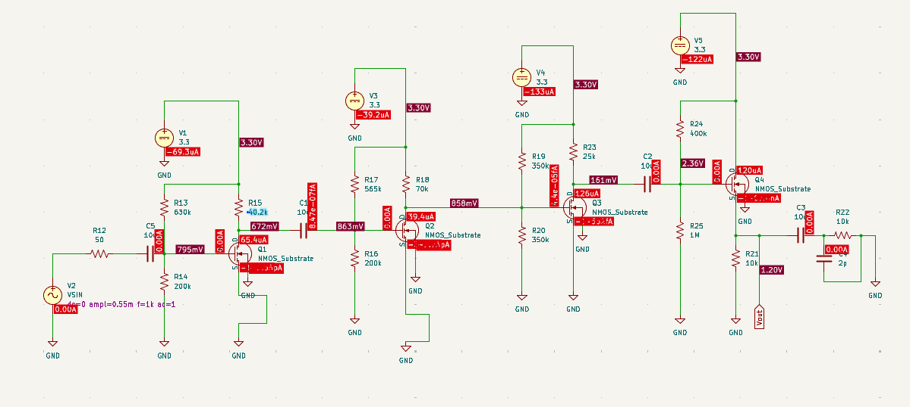
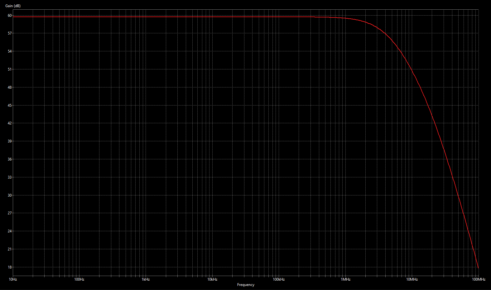
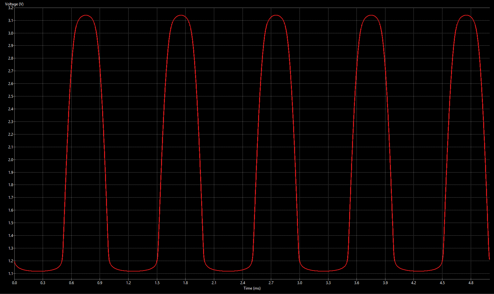

# High-Gain Low-Power 180nm CMOS MOSFET Amplifier

An open-loop, multi-stage analog voltage amplifier designed in a **GlobalFoundries 180nm CMOS** process using KiCad and SPICE. The architecture utilizes a 4-stage topology (**CS-CS-CS-CD**) to deliver **$\ge 60\text{ dB}$** gain and a **$2.0\text{ V}_{pp}$** unclipped output swing while operating strictly under a **$1\text{ mW}$** total DC power envelope.

---

## Performance Summary

| Metric | Target Specification | Simulated Result | Compliance Status |
| :--- | :--- | :--- | :--- |
| **Open-Loop Gain ($A_v$)** | $\ge 60\text{ dB}$ ($1000\text{ V/V}$) | **$60.0\text{ dB}$** | **PASS** |
| **Per-Stage Gain Limit** | $\le 40\text{ dB}$ | **$\approx 17\text{ dB} - 27\text{ dB}$** | **PASS** |
| **Output Swing ($V_{pp}$)** | $\ge 1.5\text{ V}_{pp}$ | **$2.0\text{ V}_{pp}$** ($1.12\text{ V} \text{ to } 3.15\text{ V}$) | **PASS** |
| **Total DC Power ($P_{DC}$)** | $\le 1.0\text{ mW}$ | **$0.87\text{ mW}$** ($V_{DD} = 3.3\text{ V}, I_{tot} \approx 264\ \mu\text{A}$) | **PASS** |
| **Max Branch Current** | $\le 200\ \mu\text{A}$ | **$126\ \mu\text{A}$** ($Q_3$ branch) | **PASS** |
| **-3 dB Bandwidth ($f_{-3dB}$)**| $\ge 500\text{ kHz}$ | **$\approx 2.0\text{ MHz}$** | **PASS** |
| **Input Impedance ($R_{in}$)** | $\ge 100\text{ k}\Omega$ | **$150.6\text{ k}\Omega$** ($630\text{ k}\Omega \parallel 200\text{ k}\Omega$) | **PASS** |
| **Load Sensitivity** | Gain Loss $\le 10\%$ with $R_L = 10\text{ k}\Omega, C_L = 2\text{ pF}$ | **$7.7\%$ Loss** ($A_{v4} = 0.923\text{ V/V}$) | **PASS** |

---

## Architectural Evolution

### Initial Proposal (3-Stage: CS-CS-CD)
* **Stage 1 (CS):** Provided initial voltage gain while setting $R_{in} \ge 100\text{ k}\Omega$ via gate biasing resistors.
* **Stage 2 (CS):** Provided secondary amplification to bridge toward $60\text{ dB}$.
* **Stage 3 (CD Buffer):** Provided low output impedance ($R_{out} \approx 1/g_m \approx 833\ \Omega$) to prevent gain sagging under the $10\text{ k}\Omega \parallel 2\text{ pF}$ load.

### Architectural Bottleneck
Attempting to achieve the entire $60\text{ dB}$ amplification across only two gain stages forced excessively high drain resistors under the low-current budget. This compressed the DC voltage headroom, causing premature triode-region and cutoff clipping at the output.

### Final Topology (4-Stage: CS-CS-CS-CD)
To satisfy the $1.5\text{ V}_{pp}$ swing without violating per-stage gain ($\le 40\text{ dB}$) or power constraints ($\le 1\text{ mW}$), a third Common-Source stage was inserted:
* **Stages 1–3 (Gain Core):** Three cascaded Common-Source stages distributing the $60\text{ dB}$ gain requirement ($\approx 17\text{ dB}$, $17\text{ dB}$, and $27\text{ dB}$), keeping all transistors biased comfortably in the saturation region.
* **Stage 4 (Output Buffer):** A dedicated Common-Drain (source follower) stage biased with $120\ \mu\text{A}$ to isolate the high-impedance gain nodes from the external load.

---

## Schematics & DC Operating Point

*Figure 1: Full 4-stage amplifier schematic annotated with node voltages and branch currents.*

### Stage Component & Biasing Breakdown
* **Stage 1 ($Q_1$):** $W=45\ \mu\text{m}, L=1\ \mu\text{m}$ | $R_{13}=630\text{ k}\Omega, R_{14}=200\text{ k}\Omega, R_{15}=40.2\text{ k}\Omega$ | $I_{D1} \approx 65.4\ \mu\text{A}$
* **Stage 2 ($Q_2$):** $W=90\ \mu\text{m}, L=2\ \mu\text{m}$ | $R_{17}=565\text{ k}\Omega, R_{16}=200\text{ k}\Omega, R_{18}=70\text{ k}\Omega$ | $I_{D2} \approx 39.4\ \mu\text{A}$
* **Stage 3 ($Q_3$):** $W=30\ \mu\text{m}, L=0.5\ \mu\text{m}$ | $R_{19}=350\text{ k}\Omega, R_{20}=350\text{ k}\Omega, R_{23}=25\text{ k}\Omega$ | $I_{D3} \approx 126\ \mu\text{A}$
* **Stage 4 ($Q_4$):** $W=30\ \mu\text{m}, L=0.5\ \mu\text{m}$ | $R_{24}=400\text{ k}\Omega, R_{25}=1\text{ M}\Omega, R_{21}=10\text{ k}\Omega$ | $I_{D4} \approx 120\ \mu\text{A}$

---

## Simulation Results

### 1. AC Frequency Response (Gain & Bandwidth)

*Figure 2: AC gain vs. frequency showing a flat mid-band gain of $60\text{ dB}$ and a $-3\text{ dB}$ cutoff at $\approx 2.0\text{ MHz}$.*

### 2. Large-Signal Transient Response (Output Swing)

*Figure 3: Output voltage swing across $R_L = 10\text{ k}\Omega \parallel C_L = 2\text{ pF}$ driven by a $0.55\text{ mV}$ input sine wave at $1\text{ kHz}$. Peak-to-peak output swing is $2.0\text{ V}_{pp}$ ($1.12\text{ V}$ to $3.15\text{ V}$) without triode or cutoff distortion.*

---

## Design Trade-Off Analysis

* **Gain vs. Power:** With transconductance $g_m \propto \sqrt{I_D}$, achieving $60\text{ dB}$ under $1\text{ mW}$ ($I_{total} \le 303\ \mu\text{A}$) required operating individual gain stages at low quiescent currents ($40\text{--}65\ \mu\text{A}$) and using larger load resistors ($R_D$).
* **Gain vs. Bandwidth ($GBW$):** Higher drain resistance lowers the dominant pole frequency ($f_p \approx 1/(2\pi R_D C_T)$). Channel lengths were kept small ($0.5\ \mu\text{m} \text{ to } 1.0\ \mu\text{m}$) to minimize gate-source/gate-drain capacitances, sustaining a $2\text{ MHz}$ bandwidth.
* **Linearity vs. Voltage Headroom:** Distributing the gain across three Common-Source stages lessened the signal swing burden per stage, preventing early saturation/triode distortion and enabling a clean $2.0\text{ V}_{pp}$ swing on a single $3.3\text{ V}$ supply rail.
* **Current Allocation vs. Load Sensitivity:** Nearly half of the total current budget ($120\ \mu\text{A}$) was allocated to the Stage 4 Common-Drain buffer, reducing its output resistance ($R_{out} \approx 833\ \Omega$) to limit gain degradation under a $10\text{ k}\Omega$ load to $7.7\%$.

---

## Tools Used

* **EDA & Schematic Capture:** KiCad
* **Simulation Engine:** SPICE (Transient, AC Sweep, DC Operating Point)
* **Semiconductor Technology:** GlobalFoundries 180nm CMOS ($V_{DD} = 3.3\text{ V}$, $V_{tn} = 0.63\text{ V}$, $\mu_n C_{ox} = 100\ \mu\text{A/V}^2$)
